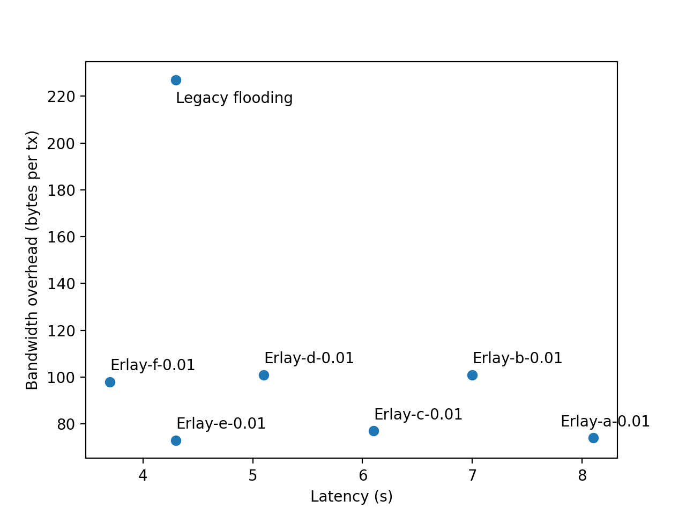

## Pick best Erlay configuration

These experiments were done to explore all reasonable Erlay configuations, and to pick the best for
the current network and for extended connectivities.

For these experiments, the network had 2,000 reachable nodes and 18,000 non-reachable nodes.
Increasing it by 2x doesn't change the results much.

The following Erlay parameters could be tweaked:
1. q choice
2. reconciliation frequency
3. in/out flooding delay
4. in/out number of peers a node floods to

## Latency
We measure the time it takes for a transaction to reach 95% of the nodes, assuming every node has 8
tx-relay peers. For this experiment, only 2, 3, 4 matter.

We label the configurations as following:

| Name        | In/Out flood delay | Reconciliation interval | In/out flood destinations |
| ------------- |:-------------:| -----:| -----:|
| Erlay-a      | 2s/5s | 2s | 2/2 |
| Erlay-b      | 2s/5s | 2s | 3/3 |
| Erlay-c      | 1s/2s | 2s | 2/2 |
| Erlay-d      | 1s/2s | 2s | 3/3 |
| Erlay-e      | 1s/2s | 1s | 2/2 |
| Erlay-f      | 1s/2s | 1s | 3/3 |

# Optimal bandwidth

The second experiment considers the first parameter, Q. We try values between 0.01 and 0.2,
and find out that q=0.01 make most sense for all, because it's best at conserving bandwidth.

It's also possible to see bandwidth breakdown (how many reconciliations failed, etc.),
and try to optimize it from there, but we leave it for further research.

# Conclusions

For now, we conclude that Erlay-e-0.01 is the most optimal configuration, because it provides
the lowest bandwidth overhead (except for Erlay-a-0.01, which is way slower)
and one of the lowest latencies on par with legacy flooding.

If broken down, Erlay-e-0.01 requires sending 1.77 txid and 1.47 short-txid per transaction, in addition
to necessary 2 * txid (inv + getdata, as per the latest erlay protocol).

Since the reconciliation failure rate is very low, the first aspect is not caused by it, but is
rather caused by the natural fanout which happens faster than flooding, and thus it can't be reduced,
unless we use yet another configuration.

This is, however, problematic: either we increase flood delays (and increase the latency overall),
or make reconciliations more frequent (and make them less efficient).

The latter aspect can be optimized by better estimating set diffenence (by choosing q better),
but it's just (1.47 * 4) bytes, which is minor compared to the overall INV traffic,
so we don't do that for now.

# Scaling with connections

Erlay-e-0.01 also scales well with the number of connections. If we increase the connectivity from
8 to 12, we get just 77 bytes of extra overhead.
